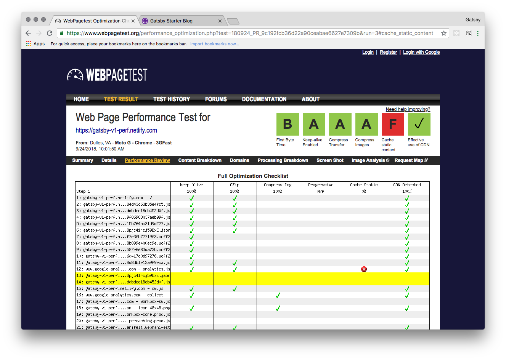
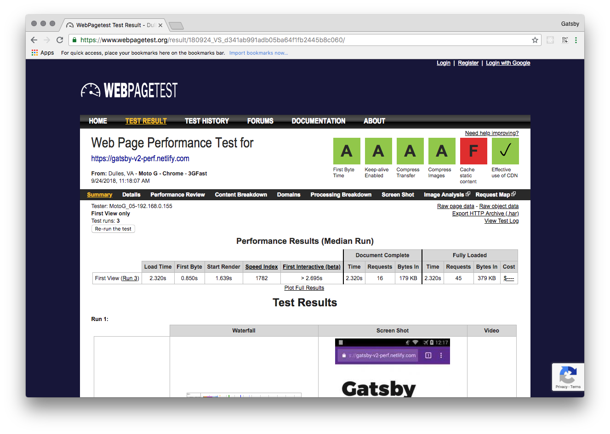
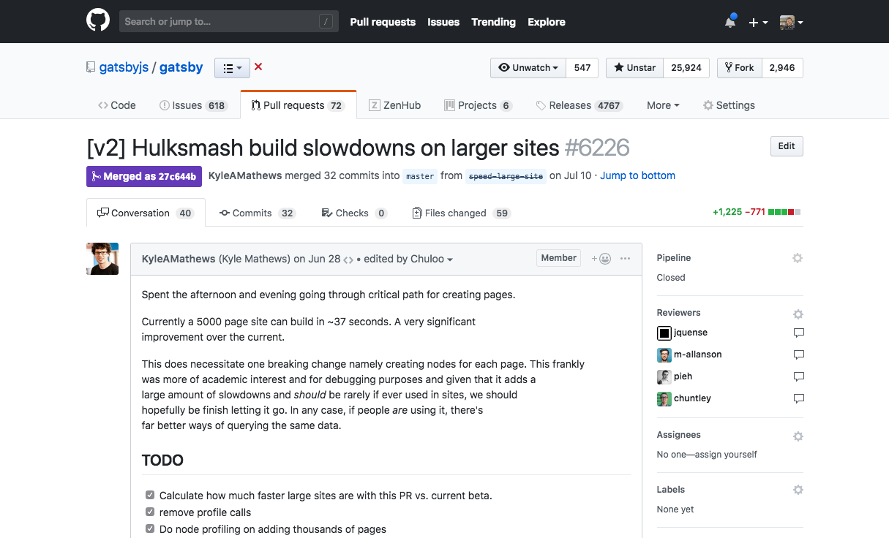
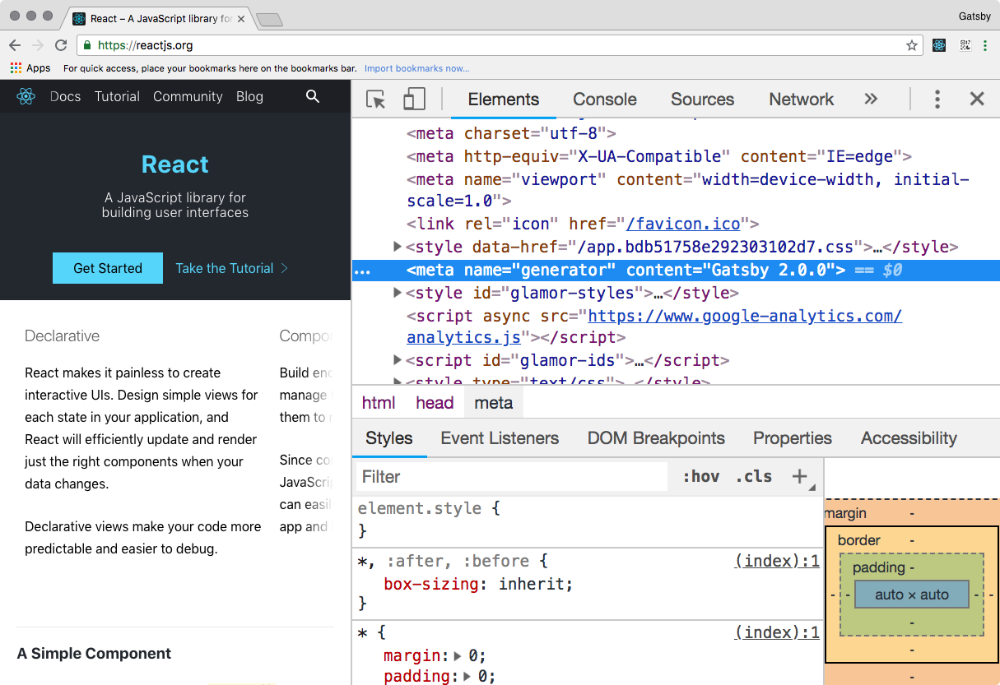

import { Head, Image, Split } from 'mdx-deck'
import { FullScreenCode, Main, Section, SectionInverted } from 'gatsby-mdx-theme'

export default Main

<Head>
  <title>Gatsby v2: Performance</title>
</Head>

# Gatsby v2
## Improving Gatsby v1 Perf.

---

export default SectionInverted

## Gatsby v2 is faster

---

export default Section

## Faster sites

## Faster builds

---

<Image src="images/v1-perf.png" size="contain" />

---

<Image src="images/v2-perf.png" size="contain" />

---

## Why?

- React 16
- @reach/router

---

|Name|Size|%  |
|:--:|:--:|:-:|
|React|`49.8kb` -> `34.8kb`|30%|
|@reach/router|`8kb` -> `6kb`|25%|

---

## `78.5kb -> 53.9kb`

### 🎉

### 31% size reduction

---

export default Split

---

## Small wins add up

---

export default Section

## Build tooling is also faster

---

<Image src="./images/ludicrous.gif" size="contain" />

---

### New speed record

> 100k pages = 75.38 seconds

# 🏎️

---

### Webpack 1 -> Webpack 4
### Babel 6 -> Babel 7
### ... and

---

---

---

export default Split

## `v1`

### `build` `50s`

### `develop` `30s`

### ⬇️

## `v2`

### `build` `25s`

### `develop` `12s`

---

## Up to `75%` improvement!

---

## Upgrade.

### It's easy.

### [Guide](https://gatsbyjs.org/docs/migrating-from-v1-to-v2/)

---

